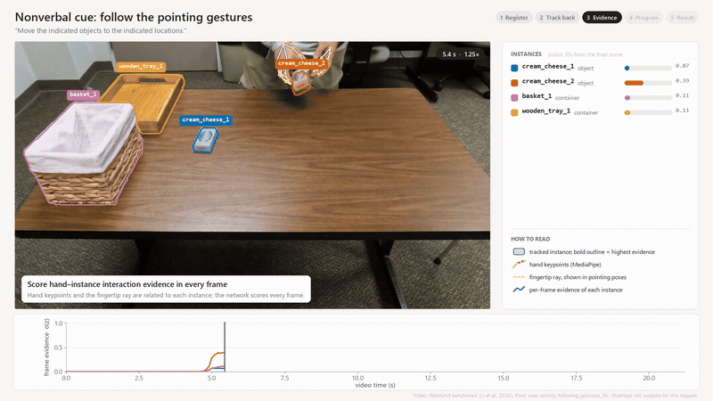

# Demonstration videos

Each clip follows one WatchAct request through the method (1920×1080, H.264):

| File | Task | Outcome |
|---|---|---|
| [`V1_nc_success.mp4`](V1_nc_success.mp4) | Nonverbal cue (pointing), front camera | success, strict success |
| [`V2_rd_success.mp4`](V2_rd_success.mp4) | Reference disambiguation among three identical boxes, side camera | success, strict success |
| [`V3_episodic_success.mp4`](V3_episodic_success.mp4) | Imitation, front camera, no task-specific training | success, strict success |
| [`V4_nc_failure.mp4`](V4_nc_failure.mp4) | Nonverbal cue, oblique camera of the activity in V1 | failure |
| [`IAE_supplementary_video.mp4`](IAE_supplementary_video.mp4) | Introduction followed by V1–V4 (2.5 min) | |

`iae_demo_preview.gif` is a 13-second excerpt of V1.

Each clip shows, in order:

1. the registration of the execution scene to the public object IDs of the task layout;
2. the propagation of these identities through the video (backwards for nonverbal cues and reference disambiguation,
   forwards for imitation);
3. the per-frame hand–instance evidence of every instance, or, for imitation, the displacement of every tracked object;
4. the program decoded from it;
5. the WatchAct score of the plan next to the ground truth and the plan of Qwen3-VL-32B, followed by the results over
   all requests of the task (Tables 1 and 4 of the paper).

**What is shown.** All overlays are outputs of the pipeline for the shown request:

- the SAM 2.1 masks, stored at a quarter of the resolution and upsampled for display;
- the MediaPipe hand keypoints;
- the evidence of the three-seed ensemble from the cross-validation fold that holds out the activity;
- the decoded program and its score.

Overlays are sampled at 10 Hz; keypoints are interpolated linearly between samples, and masks and scores use the nearest
sample. The fingertip ray is drawn only when the hand forms a pointing pose, and containers are shaded more lightly than
objects.

**How the requests were chosen.** With seed 2026, one request was drawn from each of four pools, and the first draw of
every pool was used:

| Pool | Requests |
|---|---:|
| nonverbal-cue requests solved strictly by the IAE ensemble | 33 |
| reference requests solved strictly by the IAE ensemble | 193 |
| episodic requests solved strictly | 371 |
| nonverbal-cue requests where IAE fails | 112 |

V1 and V4 happen to be two cameras of the same activity.

`scripts/figures/export_demo_cases.py` applies this rule and exports the pipeline outputs of the drawn requests.
`scripts/figures/render_demo.py` renders a clip from them and the source video.

The recordings belong to the WatchAct benchmark (Li et al., 2026, https://github.com/Baiqi-Li/WatchAct) and appear
here only as part of these clips.
